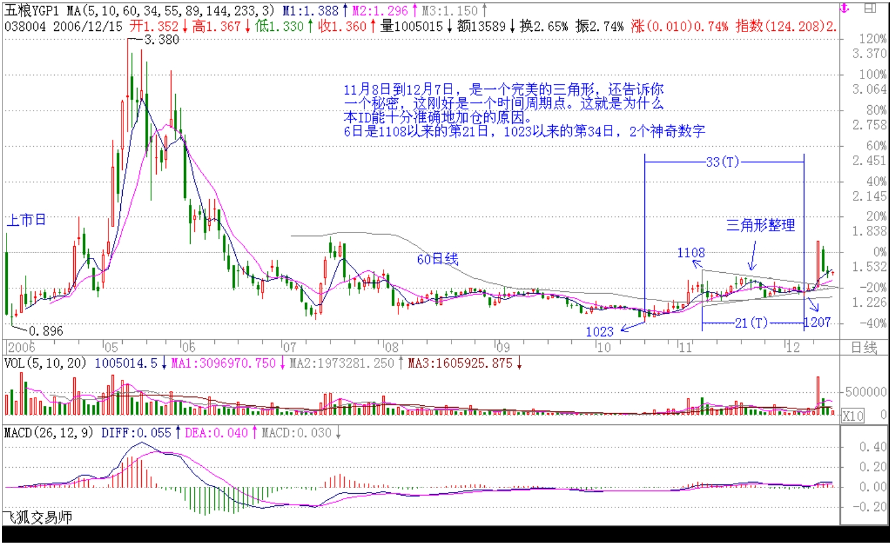
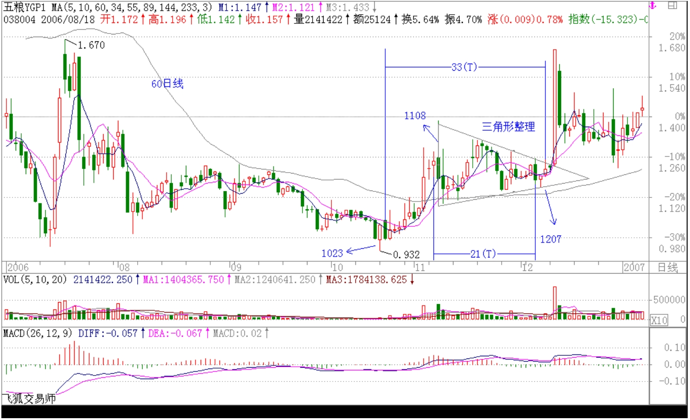
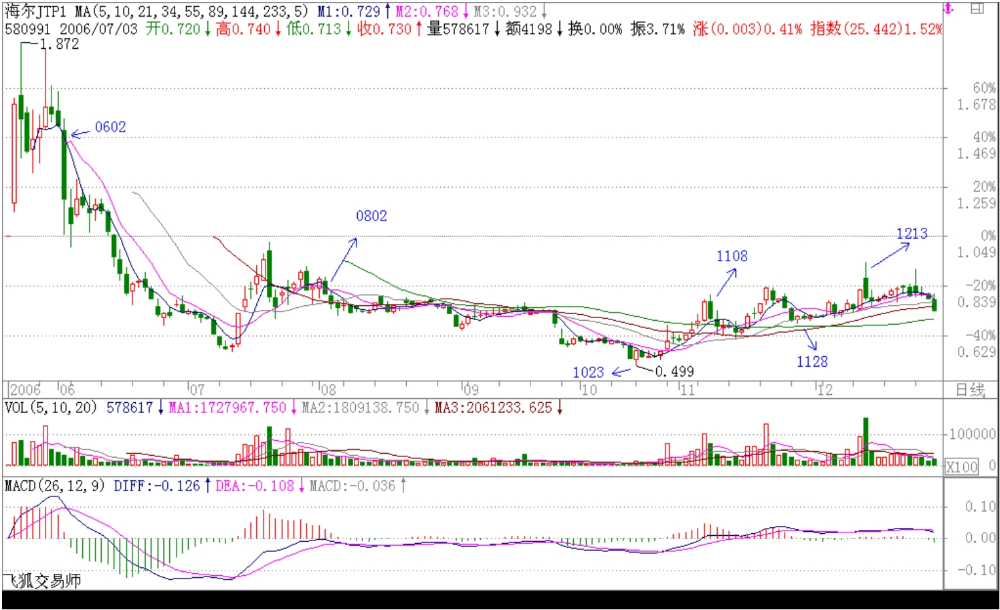
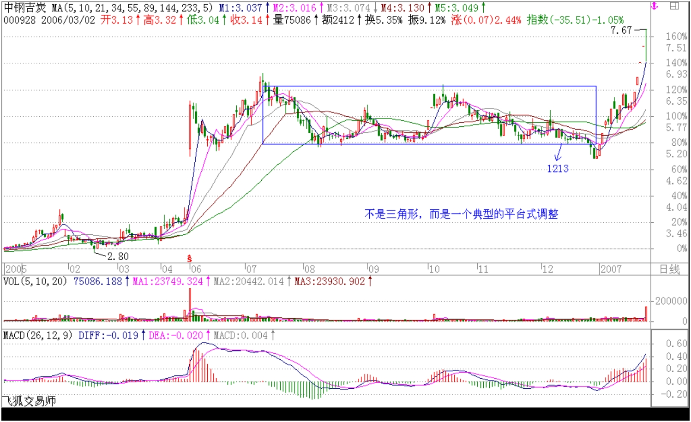
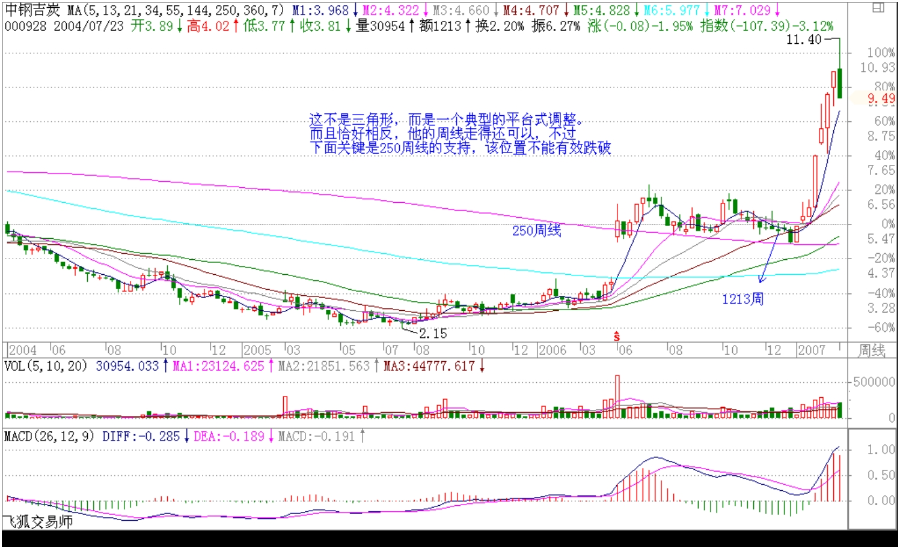

##### 教你炒股票 15：没有趋势，没有背驰。
###### (2006-12-08 11:55:57)

有人很关心诸如庄家、主力之类的事情，但散户、庄家的位次分野这类事情不过是市场之“不患”下的“患”， 对本 ID 所解《论语》熟悉的，对此都很容易理解。有些东西是超越散户、庄家的位次分野的，这是市场之根，把握了，所谓散户、庄家的位次分野就成了笑话。如果真喜欢听有关庄家的逸事、秘闻，以后有空本 ID 可以说点，而且还可以告诉你如何阻击、搞死庄家，这一点，环视国内，没有比本 ID 更有经验的了。 
 
对于市场走势，有一个是“不患”的，就是走势的三种分类：上涨、下跌、盘整。所有走势都可以分解成这三种情况。这是一个最简单的道理，而这才是市场分析唯一值得依靠的基础。很多人往往忽视最简单的东西，去搞那些虚头八脑的玩意。而无论你是主力、散户、庄家，都逃不过这三种分类所交织成的走势。 
 
那么，何谓上涨、下跌、盘整？下面给出一个定义。首先必须明确的是，所有上涨、下跌、盘整都建立在一定的周期图表上，例如在日线上的盘整，在 30 分钟线上可能就是上涨或下跌，因此，一定的图表是判断的基础，而图表的选择，与上面所说交易系统的选择是一致的，相关于你的资金、性格、操作风格等。

上涨：最近一个高点比前一高点高，且最近一个低点比前一低点高。  
下跌：最近一个高点比前一高点低，且最近一个低点比前一低点低。  
盘整：最近一个高点比前一高点高，且最近一个低点比前一低点低；或者最近一个高点比前一高点低，且最近一个低点比前一低点高。

操作的关键不是定义，而是如何充分理解定义而使得操作有一个坚固的基础。其中的困难在于如何去把握高点和低点，因为高点、低点是有其级别的，在 30 分钟图上看到的高点，可能在周线图上什么都没看到。为此，必须要均线系统来过滤，也就是前面常说的“吻”的概念，只有在“吻”前后出现的高、低点才有意义。
 
这里，首先要搞清楚“吻”是怎样产生的。如果一个走势，连短线均线都不能突破，那期间出现的高、低点，肯定只是低级别图表上的，在本级别图表上没有意义。当走势突破短期均线却不能突破长期均线，就会形成“飞吻”；当走势突破长期均线马上形成陷阱，就会形成“唇吻”；当走势突破长期均线出现一定的反复，就会形成“湿吻”。由此可见，“吻“的分类是基于对原趋势的反抗程度，“飞吻”是基本没有任何反抗力，“唇吻”的力度也一般，而“湿吻”，就意味着力度有了足够的强度，而一切的转折，基本都是从“湿吻”开始的。
 
转折，一般只有两种：一、“湿吻”后继续原趋势形成陷阱后回头制造出转折；二、出现盘整，以时间换空间地形成转折。第二种情况暂且不说，第一种情况，最大的标志就是所谓的“背驰”了。必须注意：没有趋势，没有背驰。在盘整中是无所谓“背驰”的，这点是必须特别明确的。还有一点是必须注意的，这里的所有判断都只关系到两条均线与走势，和任何技术指标都无关。
 
如何判断“背驰”？首先定义一个概念，称为缠中说禅趋势力度：前一“吻”的结束与后一“吻”开始由短线均线与长期均线相交所形成的面积。在前后两个同向趋势中,当缠中说禅趋势力度比上一次缠中说禅趋势力度要弱，就形成“背驰”。按这个定义，是最稳妥的办法，但唯一的缺点是必须等再次接吻后才能判断，这时候，走势离真正的转折点会已经有一点距离了。如何解决这个问题：第一种方法，看低一级别的图，从中按该种办法找出相应的转折点。这样和真正的低点基本没有太大的距离。
 
还有一种方法，技巧比较高，首先再定义一个概念，称为缠中说禅趋势平均力度：当下与前一“吻”的结束时短线均线与长期均线形成的面积除以时间。因为这个概念是即时的，马上就可以判断当下的缠中说禅趋势平均力度与前一次缠中说禅趋势平均力度的强弱对比，一旦这次比上次弱，就可以判断“背驰”即将形成，然后再根据短线均线与长期均线的距离，一旦延伸长度缩短，就意味着真正的低部马上形成。按这种方法，真正的转折点基本就可以完全同时地抓住。但有一个缺陷，就是风险稍微大点，且需要的技巧要高点，对市场的感觉要好点。
 
纯粹的两条均线的 K 线图，就足以应付最复杂的市场走势了。当然，如果没有这样的看图能力，可以参照一下技术指标，例如 MACD 等，关于各技术指标的应用，以后会陆续说到。

回复：

2006-11-30 15:13:57

今天大盘走势十分规范，下午两点如期一波跳水确认突破的有效性后，继续上扬，唯一不足的是启用了银行股冲关，这与深沪两市的资金争夺有关，这在每次的行情中都有体现。谁先突破历史新高，对两个市场的管理者的好处是很大的。  
明天出现震荡很正常，只要 5 日线不破，本 ID 给市场的建议能够成为现实的可能性将继续增加。个股还是看好二线股，而三线股的蓄势补涨依然可期。

2006-12-01 12:16:49

现在大盘最大的风险是上海人比较小气，因为深圳先突破历史新高几乎是不可改变的了。上海有可能故意捣乱，让大家都突破不了。这种事情听起来像天方夜谈，但历史上出现过不止一次了。但历史却一次次地证明，只要是大牛市，深圳就是比上海牛，这也是判断行情的一个很重要的经验。当深圳比上海弱时，是大行情的机会很小的。现在看到深圳比上海强，即使是上海人，也应该为此高兴。

2006-12-01 15:02:23

大盘今天如期出现震荡，目前大盘最大的危险就是前面所说的沪深之间的竞争，特别上海历史上有故意拆台的前科，这一点必须有所警惕。  
技术上，今天深圳成指留下的缺口十分重要，如果很快回补，则技术上发出不好的信号。  
下周一依然有震荡的需要，但各股行情依然继续。由于 11 月是巨阳，12 月上冲后出现大幅震荡不可避免，这必须要清醒。

2006-12-04 12:37:10 本月大盘走势，以下话依然有效：  
（2006-12-01 15:02:23 由于 11 月是巨阳，12 月上冲后出现大幅震荡不可避免，这必须要清醒。）

2006-12-04 13:24:23

短线判断大盘调整的一个最简单方法就是深沪指数的背离，一旦出现,调整或至少是震荡将很快发生。方法说了，具体就自己马上实践一下,不能什么都说好了，这样永远无法提高。

2006-12-05 11:53:53 本ID对大盘的建议继续有效，引用如下：该结论继续有效  
（缠中说禅 2006-11-29 15:14:38 从大盘健康的角度说，本ID给大盘的建议是：先深成指突破 6103 点的历史高位，然后上海跟上，突破以后再调整，这样更健康。不知道大盘有没有兴趣听本ID的意见了）

2006-12-05 12:52:01 方法都告诉你了,要举一反三:   
缠中说禅短差程序：大级别买点介入的，在次级别第一类卖点出现时，可以先减仓，其后在次级别第一类买点出现时回补。

2006-12-06 12:09:47

这震荡很正常，下午关键看深圳补完缺口后的表现，如果就此止住，就很快恢复上攻，否则还要折腾几天。赢利的股票关键看你是短线还是中线了，如果是短线，前两天开始就应该有所动作，中线正好利用这震荡弄短差。

2006-12-06 12:34:01

事情要有预见性，这震荡上周五收盘时已经说过了，昨天中午又强调了一次，如果没动，那就上上下下享受一下。5 日线是否有效突破要看下午走势，不要太快下结论。心态要好点。

2006-12-06 15:01:20

今天大盘没什么新意，都是预料中的事情，中午说了，没走的就上上下下享受一下，短线行的就忙忙弄点短差，5 日线是调整的关键。

2006-12-13 12:17:52

关于 038004 的作业，回答比较正确的是下面这位。但还是有点出入。10 月 23 到 25 日是本 ID 的见仓期，第一波上去后，11 月 8 日减了一半，后来在 60 天线附近一路回补，加仓是在 12 月 6 日、7 日两天，比第一次买的，加了 1/2 的仓位。这里的理由除了第二类买点，还有一个现在没说到的，就是三角形整理的第五波末段。该走势十分标准，自己去研究一下。昨天根据 5 分钟线的背弛出了大半，把剩下的成本是 0 了。本 ID 作权证，特别是认沽，第一轮上去都会这样减仓操作，只持有成本是 0 的仓位等待第二波，第二波是否有，这已经问题不大了，这样就绝对立于不败之地了。 

三角形的判别不看均线，直接看图形。11 月 8 日到 12 月 7 日，是一个完美的三角形，还告诉你一个秘密，这刚好是一个时间周期点。这就是为什么本 ID 能十分准确地加仓的原因。几个因数都结合在一切了。

好好研究一下 038004 日线的第二类买点构成，这是一个用三角形构造第二类买点的完美例子。

2006-12-13 12:21:37

本 ID 的权证不止 038004。还有一个的典型例子，又是一个作业。  
请用昨天回复里说的缠中说缠的 MACD 定律好好分析一下 580991，为什么本 ID 能在 10 月 23 到 25 日坚决建仓。

告诉大家一个缠中说缠的 MACD 定律：第一类买点都是在 0 轴之下背驰形成的，第二类买点都是第一次上 0 轴后回抽确认形成的。卖点的情况就反过来。

驰宏锌锗：为什么从 2004 年 6 月 2 日到 2005 年 7 月 27 日，构成标准的“下跌+盘整+下跌”的走势（见 16 课配图），而类似的图形在 580091 上不算，这唯一的原因就是因为后者在日线的下跌中并不构成日线级别的缠中说禅走势中枢，而在 30 分钟线上，这个中枢是明确的。所以 580091 只构成 30 分钟级别上的“下跌+盘整+下跌”。

而 580091 从 2006 年 10 月 23 日到 12 月 13 日，只构成日线上的盘整走势（为什么？因为在日线上明确地看到一个缠中说禅走势中枢）（11 月 8 日到 11 月 28 日，是三个次级趋势构成）。

2006-12-19 22:04:51

580091，从上市到 10 月 23 日，在日线上构成“下跌”走势，其后是一个未完成的走势类型，暂时只构成一个中枢。  
而在 30 分钟线上，6 月 2 日至 10 月 23 日是典型的“下跌+盘整+下跌”，是三种完成的走势类型的连接，好好把这里面的区别理解，才算有点真明白。

2006-12-19 22:09:38

请问缠姐：580091 在３０分钟图上 6 月 2 日至 10 月 23 日的“下跌+盘整+下跌”，第二个下跌是不是从９月１日１０：００低点之前的高点算起  
===不是，8 月 2 日

2006-12-13 16:01:38  
请教禅女：000928 现在是否面临三角形整理突破？分钟、日线图很好看，但是周线图不好看。

==============    
**这不是三角形，而是一个典型的平台式调整。** 而且恰好相反，他的周线走得还可以，不过下面关键是 250 周线的支持，该位置不能有效跌破。

